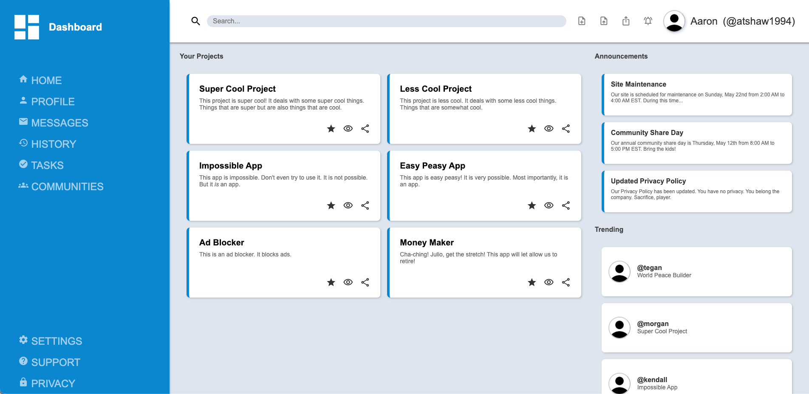

# Admin Dashboard

This project is a clean and responsive admin dashboard template. The layout is built with a combination of CSS Grid and Flexbox to create a dynamic and organized user interface, featuring distinct sections for projects, announcements, and trending topics.

## Live Preview

You can view a live preview of the site [here](atshaw1994.github.io/odin-admin-dashboard)

## Screenshot

## Features

* **Responsive Layout:** A two-column layout with a fixed sidebar and a scrollable content area.

* **Sidebar Navigation:** A sticky, fixed sidebar with a logo, dashboard links, and utility links.

* **Dynamic Header:** A header with a search bar, utility buttons, and user profile information that remains fixed at the top of the page.

* **Projects Section:** A two-column, three-row grid displaying six individual project cards. Each card includes a title, description, and interactive buttons for favorite, seen, and share actions.

* **Announcements Section:** A vertical stack of announcement cards, each with a title and a short preview.

* **Trending Section:** A section highlighting trending user profiles and their projects, with each entry featuring a profile picture, username, and trending project title.

* **Scrollable Content:** The main content area is designed to be scrollable, ensuring the header and sidebar remain visible at all times.

## Technologies Used

* **HTML5:** For the core page structure.

* **CSS3:** For styling and creating the grid and flexbox layouts.

* **Google Fonts:** Specifically, the Material Icons library is used for all icons throughout the dashboard.

## How to Run the Project

To view the project, simply open the `index.html` file in your preferred web browser.

## Acknowledgements

This project was built as part of The Odin Project's curriculum.